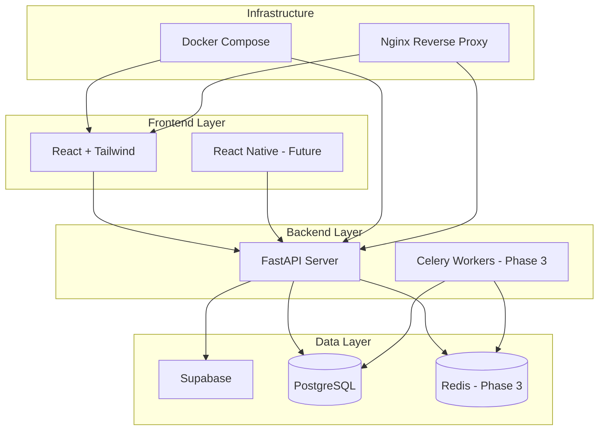
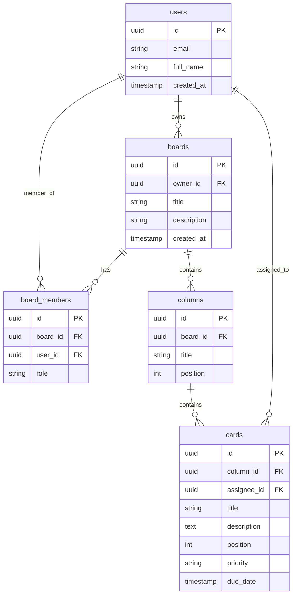

# Kanban Workflow Dashboard - Learning Project Plan

## Architecture Overview



## Do You Need Celery and Redis?

**Short answer: Not initially, but yes for production-grade features.**

| Component | When to Add | Use Cases |

|-----------|-------------|-----------|

| **Redis** | Phase 2-3 | Caching board data, rate limiting API, session storage, Celery message broker |

| **Celery** | Phase 3 | Email notifications, scheduled reminders, export generation, bulk operations |

**Why defer them?**

- Supabase provides real-time subscriptions natively (reduces Redis need for real-time)
- Learning the core stack first avoids overwhelming complexity
- You'll appreciate their value more when you hit actual bottlenecks

---

## Project Structure

```
workflow-dashboard/
├── frontend/                 # React + Tailwind
│   ├── src/
│   │   ├── components/       # Reusable UI components
│   │   ├── features/         # Feature-based modules (boards, cards, auth)
│   │   ├── hooks/            # Custom React hooks
│   │   ├── services/         # API client, Supabase client
│   │   ├── store/            # State management (Zustand or Redux Toolkit)
│   │   └── types/            # TypeScript types
│   ├── Dockerfile
│   └── package.json
│
├── backend/                  # FastAPI
│   ├── app/
│   │   ├── api/              # Route handlers
│   │   ├── core/             # Config, security, dependencies
│   │   ├── models/           # SQLAlchemy/Pydantic models
│   │   ├── services/         # Business logic
│   │   └── main.py
│   ├── Dockerfile
│   └── requirements.txt
│
├── mobile/                   # React Native (Future)
│
├── supabase/                 # Supabase migrations and config
│   └── migrations/
│
├── docker-compose.yml        # Local development orchestration
├── docker-compose.prod.yml   # Production configuration
└── README.md
```

---

## Learning Phases

### Phase 1: Foundation (Core Stack)

**Goal**: Get a working kanban board with basic CRUD operations

**What you'll learn:**

- React project setup with Vite + TypeScript + Tailwind
- FastAPI project structure and REST API design
- Supabase setup: tables, Row Level Security (RLS), auth
- Docker basics: Dockerfile, docker-compose for local dev
- API integration patterns

**Features:**

- User registration/login (Supabase Auth)
- Create/read/update/delete boards
- Create/read/update/delete columns within boards
- Create/read/update/delete cards within columns
- Basic drag-and-drop (using dnd-kit or react-beautiful-dnd)

### Phase 2: Production Hardening

**Goal**: Make it production-ready

**What you'll learn:**

- Environment management (dev/staging/prod)
- Database migrations with Alembic
- Error handling and logging
- Testing (pytest for backend, Vitest for frontend)
- CI/CD basics (GitHub Actions)
- Nginx as reverse proxy
- SSL/HTTPS setup

**Features:**

- Input validation and error boundaries
- API rate limiting
- Optimistic UI updates
- Loading states and skeleton screens

### Phase 3: Advanced Features (Celery + Redis)

**Goal**: Add async processing and caching

**What you'll learn:**

- Redis for caching and as message broker
- Celery for background tasks
- WebSockets or Server-Sent Events for real-time
- Performance optimization

**Features:**

- Real-time board updates (collaboration)
- Email notifications on card assignments
- Export boards to PDF/CSV (background job)
- Dashboard with activity metrics

### Phase 4: Mobile and Collaboration (Future)

**Goal**: Extend to mobile and team features

**What you'll learn:**

- React Native with shared business logic
- Multi-tenancy patterns
- Role-based access control (RBAC)

**Features:**

- React Native mobile app
- Team workspaces
- Card comments and activity log
- @mentions and notifications

---

## Database Schema (Initial)



---

## Key Learning Concepts Per Technology

### React + Tailwind

- Component composition and props drilling vs state management
- Custom hooks for API calls (useFetch, useBoard, useAuth)
- Optimistic updates for better UX
- Tailwind utility-first approach and custom design system

### FastAPI

- Dependency injection for database sessions, current user
- Pydantic for request/response validation
- SQLAlchemy ORM patterns
- Background tasks (built-in, before Celery)
- OpenAPI documentation (automatic with FastAPI)

### Supabase

- Row Level Security (RLS) policies - critical for multi-user apps
- Real-time subscriptions
- Storage for file attachments (card attachments)
- Edge Functions for serverless logic

### Docker

- Multi-stage builds for smaller images
- Docker Compose for local development
- Volume mounts for hot-reload during development
- Environment variable management

---

## Recommended Starting Point

Begin with **Phase 1, Step 1**: Set up the monorepo structure with Docker Compose that runs both frontend and backend with hot-reload enabled. This gives you immediate feedback loops while learning.

First file to create: `docker-compose.yml` that orchestrates:

- Frontend (React dev server on port 5173)
- Backend (FastAPI with uvicorn on port 8000)
- PostgreSQL (or connect to Supabase directly)